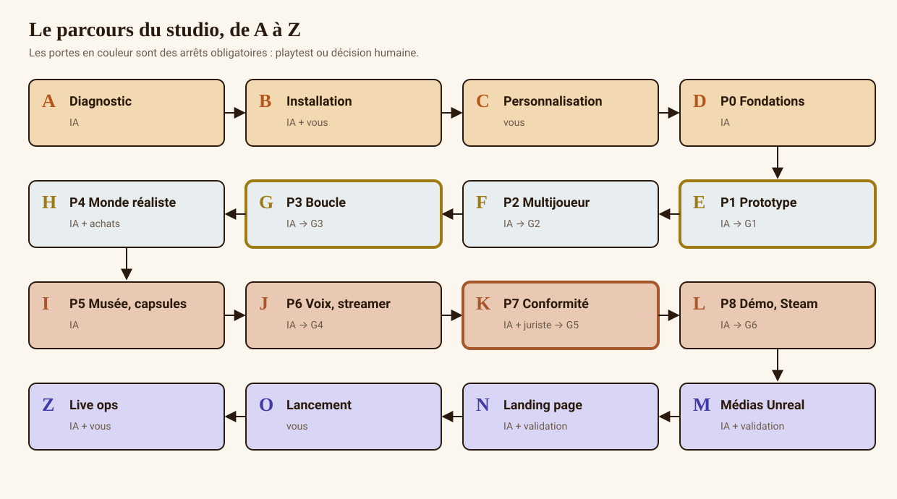

# 300 Years Later — the open-source AI game studio

🇬🇧 English · 🇫🇷 [Français](README.fr.md)

**Give this repository to Claude Code, Gemini, Kimi, Codex or any coding AI. It works autonomously from A to Z — installing dependencies, skills and plugins, coding a realistic 3D game in Unreal Engine 5.8, testing, compliance, in-engine renders, trailer and a cinematic landing page — and only comes to you for the decisions that are yours.**

> *Up to 4 friends, each stuck in a different century of the same valley. You plant a seed in year 0: your friend finds it 300 years later, grown into an oak… right above their head.*

---

## What's inside
| | |
|---|---|
| 🎮 **A fully designed game** | market study, story bible, FR/EN scripts, 12 contracts, 25 ageing recipes, numeric parameters, world, audio, UX, Unreal technical design |
| 🧠 **8 bilingual AI skills** | a studio director that orchestrates setup, code, assets, QA, legal, marketing and privacy |
| ⚖️ **A publisher-grade legal pack** | terms, privacy, DPIA, DSA, minors, virtual currencies, accessibility, creators, freelance contracts, AI transparency, ethics, tax — 22 structured drafts |
| 🌐 **A cinematic landing page** | React · Vite · TypeScript · Framer Motion: video hero, scroll-driven 4-era sequence (`docs/design/34`); switches on automatically once Unreal renders are approved; dependency-free reference version; zero trackers |
| 🎬 **A video pipeline** | shots to render in Unreal (`data/shotlist.json`) and trailer editing with Remotion |
| ✅ **Tests and CI** | Playwright, Robot Framework, k6, gitleaks, semgrep, OWASP ZAP, data validation, privacy scan, media-approval check, Unreal CI |
| 📘 **Guides** | quick start, A→Z, installation, time and cost, security, customisation, other AIs, FAQ — plus PDF guides (FR and EN) |

## Honesty first
- **The game does not exist yet**: this repository is everything needed to build it. It contains **no game image**. Visuals are specified precisely and will be rendered **inside Unreal Engine**, then approved by a human (`media/APPROVALS.md`).
- **This is not GTA.** The achievable target is a very high-quality realistic indie game. Budget: from ≈ €40k (solo + AI) to €500k+ (small team). Duration: 18 to 48 months. Everything is costed in [`docs/guides/en/03_TIME_AND_COST.md`](docs/guides/en/03_TIME_AND_COST.md).
- **The AI does not decide for you** on purchases, publishing, signatures, the public name or the price.

## Start: one message to your AI
```bash
git clone <THIS-REPO-URL> 300-years-later && cd 300-years-later
claude        # or gemini, kimi, codex, cursor, aider…
```
Then paste:
> Read AGENTS.md, then apply the game-studio skill. Work autonomously from A to Z following studio.config.yaml; only come to me at hard stops, batching your questions with your recommendation. Reply in English.
> *(optional)* Extra instructions: …

You can also set your preferences once in [`studio.config.yaml`](studio.config.yaml) (autonomy level, languages, budget, art direction, `extra_instructions`). **Your message overrides the file; the file overrides the defaults**; the safety contract overrides everything.

### What the AI does alone / what needs you
| The AI does alone | Only you (hard stops) |
|---|---|
| diagnosis, tool installation (after one global consent), plugin setup (Epic MCP, frontend-design) | create your accounts (Epic, Steamworks, GitHub) and sign in |
| C++/Blueprint code phase by phase, tests, CI, reports | install Unreal Engine from the Epic Games Launcher (login required) |
| choices with a sensible default — logged in [`DECISIONS.md`](DECISIONS.md) | any purchase (Fab assets, licences), any signature |
| bot playtests + self-review; prepares the human playtest kit | play and give your feedback (non-blocking in autonomous mode) |
| Unreal renders, Remotion editing, landing page (typographic, then cinematic) | approve each media file before publication (`media/APPROVALS.md`) |
| complete FR/EN legal drafts | lawyer review before release; public name, price |
| prepares everything to publish | publish (GitHub, Steam, website) |

Its open questions go to [`QUESTIONS.md`](QUESTIONS.md) — it keeps working on other tracks meanwhile. Three levels: `guided` (asks often), `autonomous` (default), `full` (even installs without asking).

Full guide: [`docs/guides/en/00_QUICK_START.md`](docs/guides/en/00_QUICK_START.md) · Other AIs: [`docs/guides/en/06_OTHER_AIS.md`](docs/guides/en/06_OTHER_AIS.md).

## The journey


## The skills


| Skill | Role |
|---|---|
| [`game-studio`](.claude/skills/game-studio/SKILL.md) | studio director: A→Z pipeline, autonomy protocol, safety contract |
| [`studio-setup`](.claude/skills/studio-setup/SKILL.md) | Unreal 5.8 workstation, Visual Studio, Epic's official Claude Code plugin (MCP), tools |
| [`game-build`](.claude/skills/game-build/SKILL.md) | C++/Blueprint code by phases P0→P8, tests first |
| [`game-assets`](.claude/skills/game-assets/SKILL.md) | realistic world (Landscape, PCG, Nanite), Fab, MetaHuman, ageing prefabs |
| [`game-qa`](.claude/skills/game-qa/SKILL.md) | Automation, Gauntlet, load, performance, security, compliance, go/no-go reports |
| [`legal-compliance`](.claude/skills/legal-compliance/SKILL.md) | maintains the `legal/` pack |
| [`marketing-launch`](.claude/skills/marketing-launch/SKILL.md) | Unreal renders, trailers, cinematic landing page, Steam page, presskit |
| [`privacy-guard`](.claude/skills/privacy-guard/SKILL.md) | gate before any commit or publication |

Other agents (Gemini CLI, Kimi, Codex, Cursor, Copilot, Aider…): see [`AGENTS.md`](AGENTS.md) — `GEMINI.md` and `.github/copilot-instructions.md` point to it.

## Repository map
```
studio.config.yaml  your settings for the AI (autonomy, languages, budget, extra instructions)
DECISIONS.md        decisions the AI took alone      QUESTIONS.md   questions waiting for you
.claude/            skills + AI permissions + plugins
docs/design/        game design (GDD, story, scripts, scenarios, technical, art, landing, production, QA…)
docs/guides/        human guides (FR) — docs/guides/en/ (EN)     docs/diagrams/  diagrams
docs/adr/           architecture decisions           legal/          legal pack (drafts, FR + EN)
data/               recipes, contracts, tuning, phrases, shot list
marketing/          landing (reference + React), video (Remotion), Steam page, presskit, launch plan
tests/              Playwright, Robot Framework, k6  tools/          diagnosis, validation, privacy, licences
game/               (created in P0) Unreal project — Content/ in a PRIVATE repo
```

## Security and privacy
The kit is built to **never** expose your data: nothing is read outside the repository, no data is sent out, no trackers, automatic check before every commit, security CI. See [`SECURITY.md`](SECURITY.md) and [`docs/guides/en/04_SECURITY_AND_PRIVACY.md`](docs/guides/en/04_SECURITY_AND_PRIVACY.md).

## Licences
Code: [MIT](LICENSE). Design, data, diagrams, guides: [CC BY 4.0](LICENSE-CONTENT.md). "300 Years Later" is a working title: choose and register your own before any commercial release. Files in `legal/` are drafts to be reviewed by a legal professional. Unreal Engine, Fab, Megascans and MetaHuman are governed by Epic's own licences (see [`THIRD_PARTY_LICENSES.md`](THIRD_PARTY_LICENSES.md)).

## Contributing
Recipes, Chronicle templates, translations, reports from full runs: see [`CONTRIBUTING.md`](CONTRIBUTING.md).
