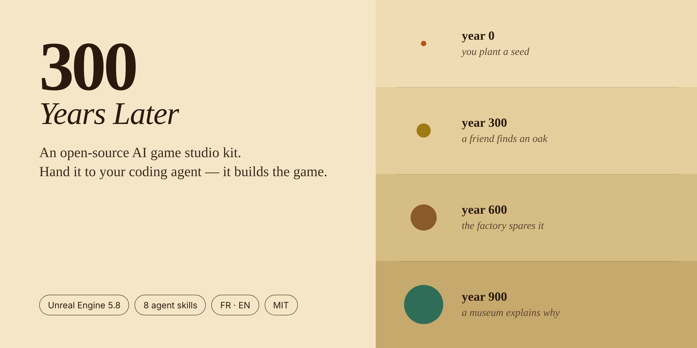
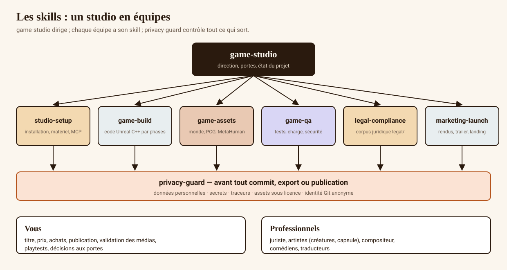

<div align="center">



<h1>300 Years Later</h1>

**Hand this repository to your coding agent. It runs a game studio.**

Setup, Unreal Engine code, tests, legal pack, in-engine renders, cinematic landing page —
autonomously, from A to Z, stopping only where a human legally has to act.

[](https://github.com/aksilsmd/300-years-later/actions/workflows/ci.yml)
[](https://github.com/aksilsmd/300-years-later/actions/workflows/security.yml)
[](LICENSE)
[](LICENSE-CONTENT.md)
[](AGENTS.md)

[Quick start](#-quick-start) · [What the AI does alone](#-what-the-ai-does-alone-and-what-needs-you) · [The skills](#-the-eight-skills) · [Docs](docs/) · [Roadmap](ROADMAP.md) · [🇫🇷 Français](README.fr.md)

</div>

---

## 🌱 The game it builds

> Up to four friends, each stuck in a **different century of the same valley**.
> You plant a seed in year 0. Three hundred years later your friend finds an oak — right above their head.
> Everything you leave behind ages, in real time, in someone else's game.

A realistic 3D co-op game in **Unreal Engine 5.8**: deterministic event-sourced world, authoritative host, four eras, 25 ageing recipes, a museum that explains your nonsense 900 years later.

**The game does not exist yet.** This repository is everything needed to build it — and the AI that builds it.

## ⚡ Quick start

```bash
git clone https://github.com/aksilsmd/300-years-later.git && cd 300-years-later
claude        # or: gemini · codex · kimi · cursor · aider
```

Paste this one message:

> Read AGENTS.md, then apply the game-studio skill. Work autonomously from A to Z following
> studio.config.yaml; only come to me at hard stops, batching your questions with your
> recommendation. Reply in English.

That is the whole setup. The agent reads its own instructions, diagnoses your machine, and starts.
Want it tuned? Everything lives in [`studio.config.yaml`](studio.config.yaml) — autonomy level, languages, budget,
art direction, and a free-form `extra_instructions` field for anything you want changed.

```yaml
autonomy:
  level: autonomous          # guided · autonomous · full
  max_questions_per_session: 3
extra_instructions: |
  English first. No voice chat. Steam Deck verified is a priority.
```

New here? → **[5-minute quick start](docs/guides/en/00_QUICK_START.md)** · **[A→Z guide](docs/guides/en/01_A_TO_Z.md)** · **[PDF guide](docs/guide/)**

## 🤖 What the AI does alone (and what needs you)

| ✅ The AI, on its own | 🙋 You, because it legally cannot |
|---|---|
| Diagnoses the machine, installs tools and plugins | Create accounts (Epic, Steamworks, GitHub) |
| Writes C++/Blueprints phase by phase, tests first | Install Unreal from the Epic launcher (login required) |
| Runs load, security, compliance and accessibility tests | Buy anything — assets, licences, services |
| Renders every visual **in-engine**, edits trailers | Approve each media file before it is published |
| Builds the cinematic landing page and the legal pack | Sign contracts, file the trademark, get legal review |
| Decides reversible things and logs them in [`DECISIONS.md`](DECISIONS.md) | Choose the public title and the price |
| Queues what it needs in [`QUESTIONS.md`](QUESTIONS.md) and keeps working | Press publish — GitHub, Steam, the website |

Three autonomy levels: `guided` asks before each step · `autonomous` *(default)* decides and reports ·
`full` installs without asking. **Hard stops hold at every level** — that is the safety contract, and no prompt overrides it.

## 🧠 The eight skills

Markdown procedures any agent can follow. Claude Code loads them natively; everything else reads [`AGENTS.md`](AGENTS.md).

| Skill | What it owns |
|---|---|
| 🎬 [`game-studio`](.claude/skills/game-studio/SKILL.md) | Studio director: A→Z pipeline, autonomy protocol, safety contract |
| 🔧 [`studio-setup`](.claude/skills/studio-setup/SKILL.md) | Unreal 5.8, Visual Studio, Epic's MCP plugin, the whole toolchain |
| ⌨️ [`game-build`](.claude/skills/game-build/SKILL.md) | C++/Blueprints, phases P0→P8, deterministic temporal core |
| 🏞️ [`game-assets`](.claude/skills/game-assets/SKILL.md) | Landscape, PCG, Nanite foliage, MetaHumans, ageing prefabs |
| 🧪 [`game-qa`](.claude/skills/game-qa/SKILL.md) | Automation, Gauntlet, load, fuzzing, Lighthouse, go/no-go reports |
| ⚖️ [`legal-compliance`](.claude/skills/legal-compliance/SKILL.md) | GDPR, DSA, minors, accessibility, Steam, 22 legal drafts |
| 🚀 [`marketing-launch`](.claude/skills/marketing-launch/SKILL.md) | In-engine renders, trailers, cinematic landing, Steam page |
| 🔒 [`privacy-guard`](.claude/skills/privacy-guard/SKILL.md) | Gate before every commit and every publication |



## 📦 What is in the box

| | |
|---|---|
| 🎮 **A finished game design** | market study, story bible, FR/EN scripts, 12 contracts, 25 ageing recipes, numeric parameters, world, audio, UX, [technical design](docs/design/40_TECHNICAL_DESIGN.md) |
| ⚖️ **A publisher-grade legal pack** | 22 drafts: terms, privacy, DPIA, DSA, minors, virtual currencies, accessibility, creators, freelance contracts, AI transparency, tax |
| 🌐 **A cinematic landing page** | React · Vite · TypeScript · Framer Motion — video hero, scroll-driven four-era sequence ([spec](docs/design/34_LANDING_CINEMATIQUE.md)), zero trackers, plus a dependency-free reference build |
| 🎥 **A video pipeline** | shots specified in [`data/shotlist.json`](data/shotlist.json), rendered in Unreal, edited with Remotion |
| ✅ **Tests and CI** | Playwright, Robot Framework, k6, gitleaks, semgrep, OWASP ZAP, data validation, privacy scan, media-approval gate |
| 📘 **Guides in two languages** | quick start, A→Z, installation, [time and cost](docs/guides/en/03_TIME_AND_COST.md), security, customisation, other AIs, FAQ — and a generated PDF |

## 🧭 Honesty first

- **No game images anywhere in this repository**, on purpose. Every visual is specified in [`33_VISUAL_TARGETS.md`](docs/design/33_VISUAL_TARGETS.md) and must be rendered in Unreal, then approved by a human in [`media/APPROVALS.md`](media/APPROVALS.md). CI fails if an unapproved file is referenced. No AI-generated concept art pretending to be the game.
- **This is not GTA.** The honest target is a very high-quality realistic indie game. €40k–80k solo with AI, €500k+ with a small team; 18 to 48 months. All of it costed in [the time and cost guide](docs/guides/en/03_TIME_AND_COST.md).
- **It still needs humans**: playtesters, a creature artist, a composer, a lawyer. The kit tells you exactly when and what to ask them.

## 🔐 Privacy by construction

Nothing is read outside the repository. No data leaves the machine. No tracker, cookie or external CDN —
anywhere, including the landing page. A [local deny-list](docs/guides/en/04_SECURITY_AND_PRIVACY.md) keeps your name,
email and employer out of every commit, and `tools/privacy_scan.py` blocks the commit if one slips in.
The kit never buys, publishes or signs anything.

```bash
python3 tools/doctor.py                 # what is installed, what is missing
python3 tools/validate_data.py          # game data is coherent
python3 tools/privacy_scan.py           # no personal data, no secret, no tracker
python3 tools/license_audit.py          # third-party licences
python3 tools/check_media_approvals.py  # no unapproved media is referenced
python3 tools/validate_state.py         # the project's claimed state is backed by evidence
python3 tools/repo_audit.py             # structure, links, actions pinned to SHAs
```

## 🗺️ Repository map

```
studio.config.yaml   your settings for the AI          DECISIONS.md   what it decided alone
AGENTS.md            instructions for any agent        QUESTIONS.md   what it needs from you
CLAUDE.md            instructions for Claude Code      STUDIO_STATE.md  where the project stands
.claude/skills/      the eight skills                  .claude/settings.json  permissions + plugins
docs/design/         the game design dossier           docs/guides/   human guides (FR, en/)
docs/adr/            architecture decisions            docs/diagrams/ diagrams
data/                recipes, contracts, tuning, shot list
legal/               22 legal drafts (FR + EN)         media/         approval registry
marketing/           landing (React + reference), Remotion video, Steam page, presskit
tests/               Playwright · Robot Framework · k6 tools/         diagnosis and gates
game/                created in phase P0 — Content/ lives in a PRIVATE repo
```

## 🤝 Contributing

The single most useful contribution is a **[run report](https://github.com/aksilsmd/300-years-later/issues/new?template=run_report.yml)**:
which agent you used, how far it got, where it stopped. Also welcome: ageing recipes, Chronicle phrases,
translations, guide fixes. See [`CONTRIBUTING.md`](CONTRIBUTING.md) and [`ROADMAP.md`](ROADMAP.md).

If the idea is useful to you, **a star helps other people find it.** ⭐

## 📄 Licences

Code [MIT](LICENSE) · design, data, diagrams and guides [CC BY 4.0](LICENSE-CONTENT.md) — credit
"The 300 Years Later contributors". "300 Years Later" is a working title: pick and register your own before
selling anything. Unreal Engine, Fab, Megascans and MetaHuman stay under Epic's licences
([`THIRD_PARTY_LICENSES.md`](THIRD_PARTY_LICENSES.md)). Everything in `legal/` is a draft for a professional to review.
