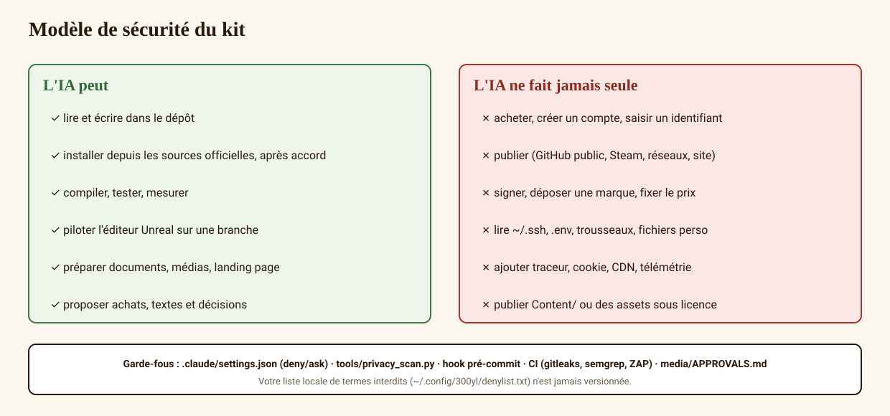

# Security and privacy: how the kit protects you

🇫🇷 [Version française](../04_SECURITE_ET_CONFIDENTIALITE.md)



## 1. What the AI may do alone
Read and write **inside the repository**, install tools **from official sources** (after one global consent in `autonomous` mode, without asking in `full` mode), compile, test, drive the Unreal editor through MCP on a branch, prepare documents and media, take reversible decisions logged in `DECISIONS.md`.

## 2. What the AI never does alone (hard stops, at every autonomy level)
| Action | Why |
|---|---|
| Buy (assets, Steam Direct, contractors) | your money |
| Create an account, type in credentials | your identity |
| Publish (public GitHub, Steam, social networks, website) | your responsibility as publisher |
| Sign, file a trademark | legal commitment |
| Choose the title, price, public copy | publisher decisions |
| Read your personal files, SSH keys, `.env`, keychains | `deny` rules in `.claude/settings.json` |
| Send your data to a third-party service | no network call outside official sources |
| Add a tracker, cookie, CDN | forbidden and detected by `privacy_scan.py` |
| Publish `game/Content/` or Epic/Fab/MetaHuman assets | forbidden by licences, blocked by CI |
| Publish an unapproved media file | `media/APPROVALS.md` + `check_media_approvals.py` |

## 3. Protect your personal data
1. Create `~/.config/300yl/denylist.txt` (outside the repo) with your first and last name, email, handle, employer, city. `tools/privacy_scan.py` will reject any file containing them.
2. Configure Git with GitHub's anonymous address: `git config user.email "<id>+<handle>@users.noreply.github.com"`.
3. Enable the pre-commit check: `git config core.hooksPath .githooks`.
4. Use an email address dedicated to the project for all public texts (terms, legal notice, press).
5. Strip media metadata before publishing (`exiftool -all=`) — the `privacy-guard` skill does it.

## 4. Check for yourself
```bash
python3 tools/privacy_scan.py
cat .claude/settings.json
git ls-files | grep -Ei '\.(uasset|umap|pak)$|^game/Content/'   # must be empty
```

## 5. Players
The game applies privacy by default (`legal/03`, `legal/09`): voice never recorded, opt-in statistics, friends-only sessions by default, no in-app purchase.
